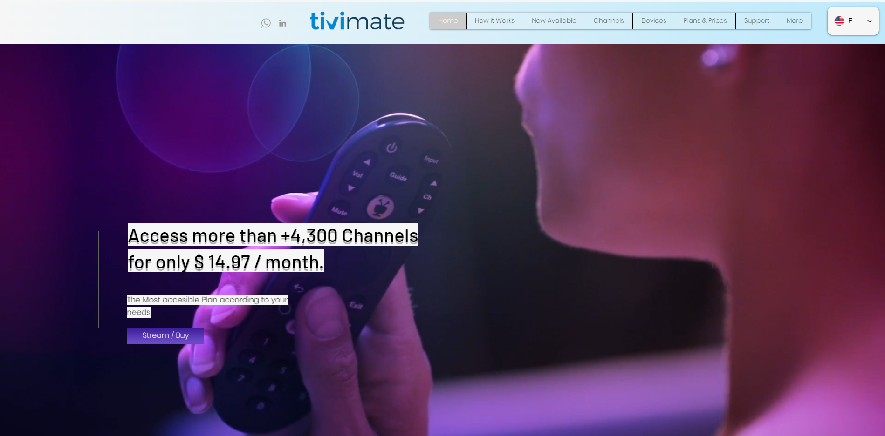

# 项目开发的心得及使用方法

​	先来聊聊为什么要搞这个Repository吧，我个人从小就是个电视迷，至于说迷到什么程度呢，现在还能记得所有央视+卫视的台号以及顺序。央视里面最喜欢看的节目是CCTV10的我爱发明和百家讲坛，至于说卫视，大家应该都记得浙江卫视在周一到周五白天播喜羊羊与灰太狼吧（当然是老版的，新版改画风后再没看过，不过近期b站上线了正版的喜灰，画质还精进到了1080P）。此外，最喜欢看的当然是卡酷卫视，金鹰卡通，动漫秀场，再加上央视的少儿频道，不得不说当年的国漫质量是很高的，洛洛历险记，猪猪侠，超兽武装，果宝特攻……

​	然而时过境迁，沧海桑田，现阶段的人们普遍被各种带货直播、短视频所冲击，又有多少人能够静下心来坐在电视机前看那些曾经最喜欢的节目呢？其实造成这种情况也包括如今智能电视和视频商的“套娃”式收费，就连追个剧都要在“爱优腾”平台之间辗转奔波，甚至手机电脑端的会员和电视端的会员竟然不通用，还要开通那所谓的超级会员才能在电视端观影，而及时你开过了会员，还要去“享受”会员专属广告和暂停广告，这波吃相属实是过于难看了。

​	从21年开始，我也终于忍受不了联通运营商赠送的网络机顶盒带来的垃圾画质，索性将电视和电视盒子都更换了（当时没想到现在的电视也能装app，其实那个电视盒子没有买的必要）。尽管如此，因为我是在拼多多上购买的"破解版"盒子，说白了就是里面安装了一些破解的app罢了，记得看电视直播用的是一个叫火星直播的app，然后电影电视剧动漫等等是用一个叫361影视的东西。毕竟当时还是小白，这些东西已经算是够用了，不过大部分时间是不能榨干电视的性能，即4k画质。

​	真正的转折出现在23年7月，随着拼多多商家的跑路，他们不再维护那个叫做361影视的app后，我只能在网上冲浪，寻求解决之法，终于让我发现了[TVBox](https://github.com/CatVodTVOfficial/TVBoxOSC)这款神器，当时的我简直是两眼放光，仿佛是发现了新大陆一般。其实这款软件只是一个单仓版的空壳，里面没有任何的资源和内容，需要你填入大佬的在线包或本地包才能使用。现在我也看到好多不良商家利用网上开源免费的线路集成到TVBox之后，换个皮，就敢在网上招摇撞骗，用别人的劳动成果来赚取利润真是无耻至极！当时由于本人的能力有限，连本地包都没有搞明白怎么装到电视上，只用了云星大佬的在线包，不过这种线路的性质都属于砸大厂生意的存在，也会挡住某些单位的财路，被攻击也必然是常规操作，总的来说使用体验不是很好。遗憾的是，我还没来得及研究本地包的使用方法，就接到了某校的夏令营通知（当时主要在准备推免的事情），匆匆离开家里了。

​	然后时间来到23年11月，广电总局封杀了电视家——一款可以享受上千个电视直播的app，致使我之前充值过的火星直播永久会员也不复存在了（都是使用电视家的直播源）。而且所有类似的软件都已经属于被严重盯防的对象，甚至在好多的q群里面也禁止讨论直播的话题，真的是一片肃杀之气。不过仅仅这样怎么会难住懂点技术的我呢（嘚瑟一下），我发现网上好多大佬扒下来一些运营商的iptv直播源，当然这里也涉及到好多专业的知识，权衡利弊之后，我选择了自己手搓一个ipv6的直播源m3u文件，至于说台号顺序呢，当然要和小时候有线电视的顺序一样，不然怎么会有当初的感觉呢哈哈哈。

​	在写好直播源后，我的精力又放到了TVBox本地包上，这时候我在q群的各位大佬帮助下已经能够利用甲壳虫ADB将本地包上传到电视上了，并且也熟练掌握了影视仓、可视TV两款当下最流行的魔改多仓版TVBox。这里先来解释几个概念：单仓，多仓，本地包和在线包。首先单仓是一个仓库下有多条线路，而原版的TVBox只支持单仓，对应来说多仓就是代表多个仓库，每个仓库下有着多条线路。而所谓的在线包一般可以是一个仓库，本地包呢可以用其中的单仓，也可以灵活的将在线包构成的仓库集成进去。当然，如果你从来没听说过这些东西可能也不知道我在讲什么，不过没有关系，你就当听个故事。

​	还有另外一件重要的事情就是我本人是百度网盘的重度用户，现在会员已经冲到了2029年，这个东西在电视上也有一款app，不过当观看50G以上的原盘电影文件变开始限速了，我最开始以为是网络的问题，后来一测感觉不对劲，于是又开始寻求解决方法了。终于让我发现了一款Alist的神器，支持好多网盘的Webdav挂载，并且会员是不限速的，如果将我的百度网盘挂载上，在用电视端的最强播放神器Kodi进行Webdav挂载Alist不就可以看我网盘里的原盘电影了吗。最让我惊喜的是，网上有个小雅大佬制作了一个阿里云盘的超集网站，也可以挂载到自己搭建的Alist上。但是吧，这个Alist如果安装到Windows上，需要让电脑保持开机状态才能使得电视端能实现Webdav挂载Alist，这显然不现实。而Alist最强大的一点在于能够安装到Linux服务器上，这里你可能会将Nas脱口而出。

​	其实就我个人而言，我已经拥有了超大空间的网盘，对于本地空间并没有过大的需求。况且由于大家对于小雅网站的挂载需求过高，大佬也不得不关闭了其他人挂载网站的权限，这时候我如果想要观看小雅网站上的内容，需要自己建立docker容器来搭建。同样的，用Windows来运行docker容器也不是最好的方案。这时呢，我最大的需求就是一台Linux服务器，来跑我的Alist和小雅Docker，并且我还有想要实现家庭范围内全局科学上网的需求。综合以上情况而言，软路由这个新事物引起了我的注意（当然软路由也因为这个功能在电商平台上不得不改名了，好像是叫什么便携式小主机？）

​	我目前使用的软路由是倍控的N5105，23年双十一时冲的，花了大概1000大洋，拿到手后，我便将系统刷到了最主流的Openwrt（一种适用于路由器的Linux操作系统），又因为原版的Openwrt过于简陋，我便选择了国内又一个永爱发电的组织酷友设编译的iStoreOS，这款系统简直是太棒了，对于我这个小白来说十分的友好。之后呢，我也顺利的搭建好了自己的Alist和小雅Docker，不过这时候只支持内网访问。

​	再回到TVBox上，因为小雅的Docker已经包含了一个.json文件，经过我对于本地包代码的研究，我竟然成功的将小雅网站上的内容集成到本地包上了，当时真的好激动！同时我也写了一个自己的.json文件，终于用上了自己的专用线路，同时我还把自己之前手搓的直播源给写进去了，真的是完美！！！

​	本以为这样就结束了，直到我兴奋的将自己修改的本地包给我一很好的哥们用时，发现将本地包传到电视上的过程太过于繁琐了，并且我集成的小雅网站由于无法在外网（此处是指家庭网络外，用手机流量也算）无法访问，效果属实是大打折扣。于是我接着寻找解决方案，继续折腾哈哈哈。

​	后来我找了联通师傅上门服务了，要来了公网ip（可能是我家这个地方用公网的需求不多，师傅竟然直接把权限放开了），但是又出现了另外一个问题，即家庭的公网ip是动态的ip，每当软路由或光猫重启之后宽带的ip都会改变。为了解决这一麻烦，我又去阿里云上购买了一个十年的域名，再利用ddns解析服务将我购买的域名和软路由的ip地址绑定。这时，我利用Docker搭建的小雅网站终于能在公网访问了。现在就剩下最后一个问题了，即本地包的在线维护，如果实现这个功能，其他人只需要输入一条链接就能得到一个拥有本地包同样功能的在线线路了。

​	这个功能在近几天也实现了，我最开始想把本地包搞到Github上进行维护的，但还是那个老生常谈的问题，虽然我家里面的网络访问Github不成问题，但是交给其他人用有时就会出问题了。然后我发现最近好多加速链接也逐渐不能用了，只好继续折腾软路由，建立一个自己的在线仓库。终于在不断地尝试过后，经历了无数次的失败，我总算是搞清楚了各文件直间的逻辑，再更改了一些关键路径之后，我终于成功了。前前后后，耗时近一年，我终于拥有了自己的在线包，随时在电脑上可以修改，并且能够立刻同步，不会像Github上存在延时问题了。

​	暂时先到这吧，这个部分以后还会更新。使用方法部分再慢慢补充。

## Live Sources for IPV6

### IPV6 live sources will be continuously updated

Sources are from:

- [YueChan](https://github.com/YueChan/Live)
- [Ftindy](https://github.com/Ftindy/IPTV-URL)
- [fanminming](https://github.com/fanmingming/live)

EPG Sources are from:

- [fanmingming](https://github.com/fanmingming/live)
- [112114.xyz](https://diyp1.112114.xyz)
- [epg.51zmt.top:8000](http://epg.51zmt.top:8000/)

### 使用说明

- 方法一（推荐）：TiviMate，安装到电视上导入m3u文件，想体验正版的朋友可以去闲鱼上49块钱购入正版账号，前往[官网](https://www.tivimate.org/)查看使用说明，并下载最新版本使用。

  

- 方法二：在任意版本TVBox（影视仓、可视TV等）中填入直播源链接即可。

